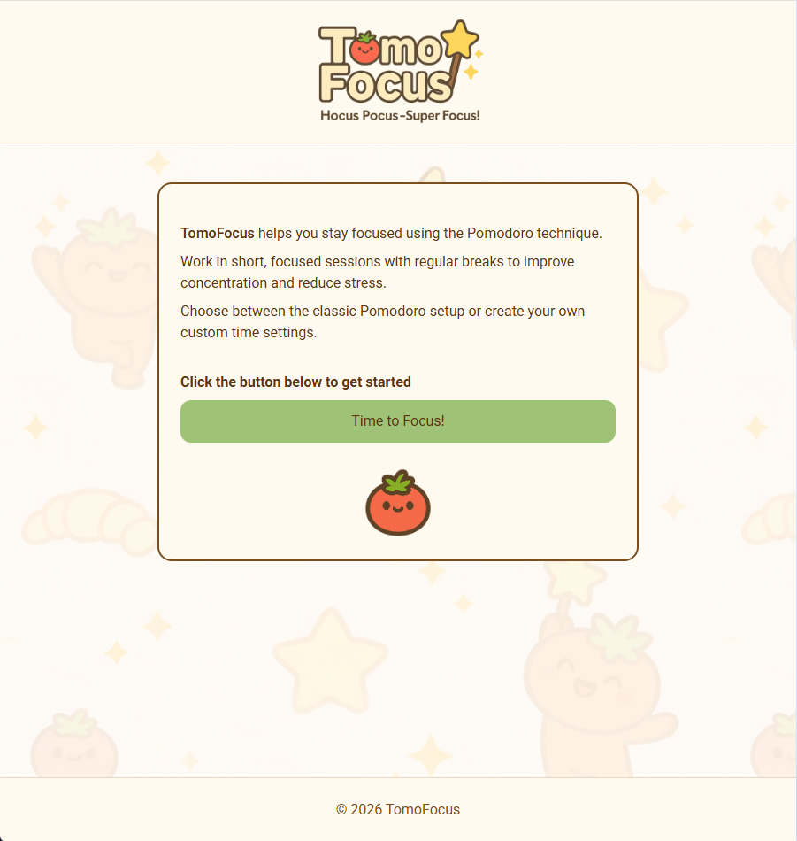
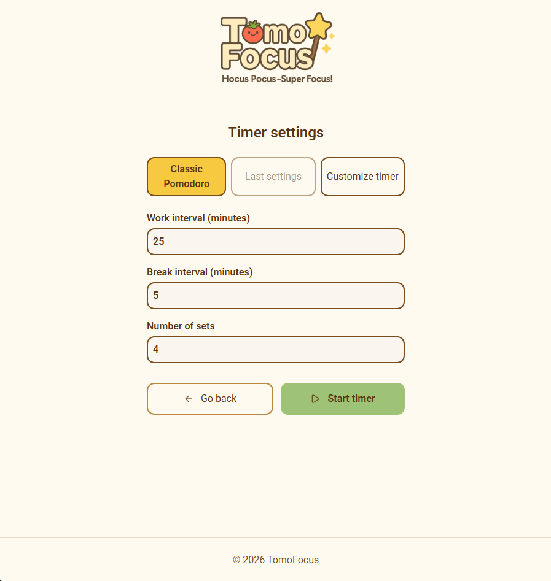
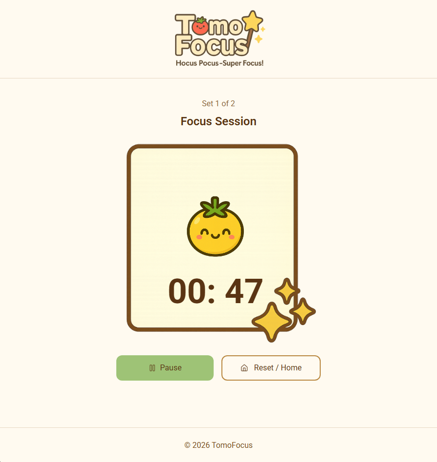
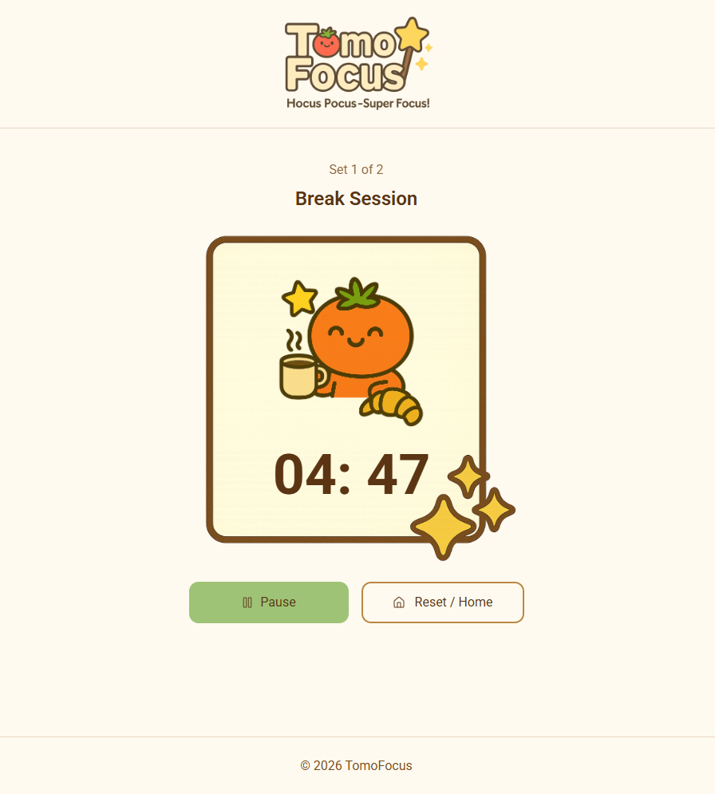
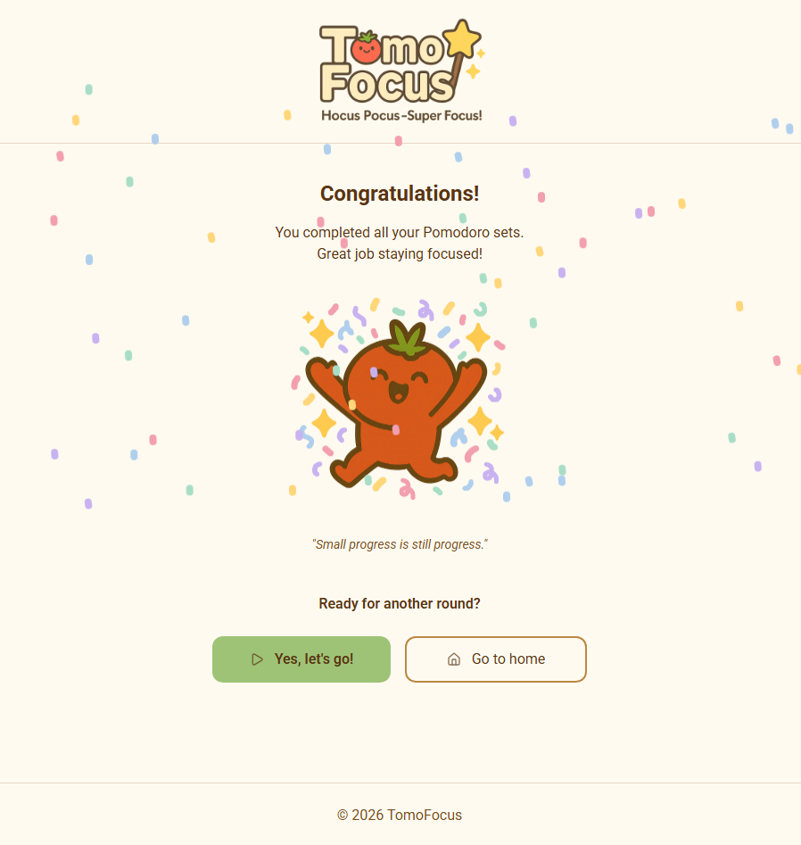
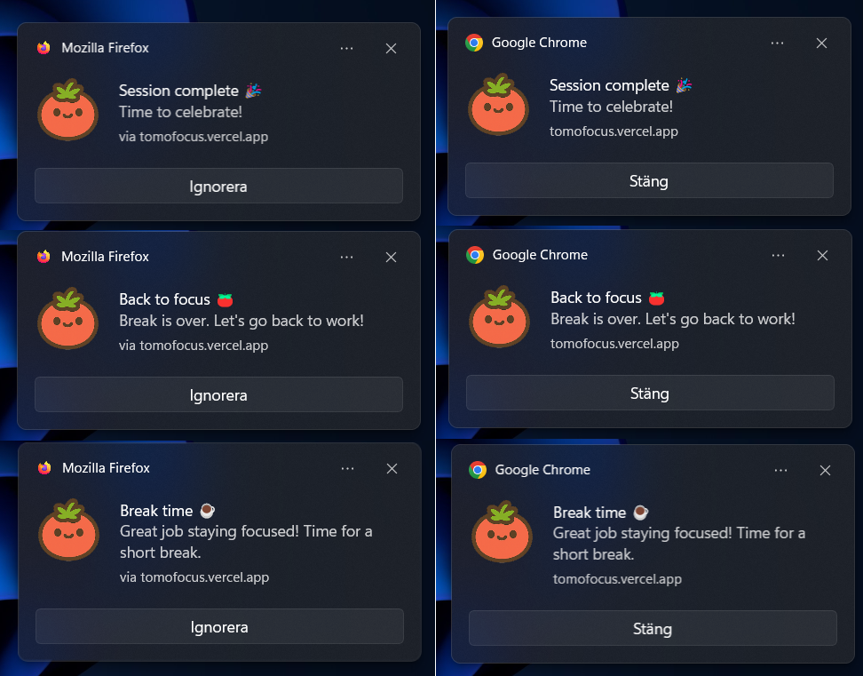
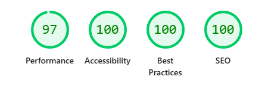

# 🍅 TomoFocus  

Welcome to **TomoFocus**, a cozy focus companion built around the Pomodoro technique.  
Designed to make focused work feel calmer, more motivating, and more enjoyable.

**TomoFocus** is a web-based Pomodoro timer designed to support focused work through a calm, inviting interface, a clear session structure, and gentle feedback.  

The application combines frontend state management, browser APIs, and a custom backend API to deliver a reliable and engaging focus experience across devices.

---

## 🔍 Project overview  

**TomoFocus** was developed as a final degree project (examensarbete) as part of my studies at  
[Medieinstitutet](https://medieinstitutet.se/).

The goal of the project was to design and implement a fully functional, user-friendly focus timer that:
- Encourages productive work sessions
- Provides clear feedback through visuals, sound, and notifications
- Works both online and offline, with core functionality available after an initial online load
- Emphasizes usability, accessibility, and a cohesive visual identity

In addition to the core timer functionality, the project also includes:
- A custom-built backend API for inspirational quotes
- Progressive Web App (PWA) support for installation on mobile devices

The project was planned and developed using an agile, sprint-based workflow with a Trello-managed backlog, supported by early wireframes and a simple design system created in Figma to maintain visual consistency.

---

## 🎥 Demo
[Click here to view the demo](https://tomofocus.vercel.app/).

---

## 📸 Screenshots
**Startpage**


**Timer settings**


**Focus session**


**Break session**


**Complete page**


**Notifications**


---

## ✨ Features  

- **Pomodoro-based timer**
  - Classic Pomodoro setup (25/5 minutes, 4 sets)
  - Resume from most recent settings
  - Fully custom timer configuration (focus time, break time, number of sets)

- **Focus & break sessions**
  - Automatic transitions between focus and break
  - Pause and resume functionality
  - Clear session state indicators (focus / break)

- **Progress-based illustrations**
  - Visual illustrations update dynamically based on focus session progress
  - Separate illustration for break sessions
  - Completion illustration shown at the end of all sets

- **Completion screen**
  - Standardized congratulatory message after completing all sessions
  - Confetti animation for positive reinforcement
  - A randomly selected inspirational quote
  - Option to return to start and begin a new session

- **Audio & notifications**
  - Gentle sound cues for:
    - Session start
    - Focus → break
    - Break → focus
    - Completion
  - Browser notifications as a secondary feedback channel
  - User-controlled permissions for both sound and notifications

- **Offline-friendly**
  - User settings stored in LocalStorage
  - Designed to work reliably without an internet connection

- **Inspirational quotes**
  - A custom-built API provides short, motivational quotes
  - A new quote is displayed on the completion screen after each finished session
  - The API was developed specifically for this project

- **Progressive Web App (PWA)**
  - Can be installed directly on the device home screen
  - Provides an app-like experience on mobile devices
  - Works reliably even with limited connectivity

---

## 🌍 Accessibility & Responsiveness  

- **Mobile-first design**, optimized for:
  - Mobile
  - Tablet
  - Desktop

- Accessibility considerations include:
  - Semantic HTML
  - Keyboard navigation
  - Clear visual hierarchy
  - Sufficient color contrast
  - ARIA roles where appropriate

---

## ♿ Accessibility & Quality Evaluation
Accessibility and performance were tested using: 
- Lighthouse
- WAVE 
- Manual testing 
- NVDA

Screen reader behavior was tested using NVDA, and the application follows recommended patterns for semantic structure, focus handling, and ARIA usage. Some differences in screen reader output may occur depending on browser and screen reader mode.


### Lighthouse evaluation


The application was evaluated using Google Lighthouse to assess performance, accessibility, best practices, and search engine optimization.

**Performance: 94**
The application demonstrates strong performance with fast initial rendering and minimal main-thread blocking. First Contentful Paint (0.8s), Largest Contentful Paint (2.0s), and Total Blocking Time (0ms) indicate a responsive and efficient user experience. Performance optimizations include reserving layout space for images and converting key visual assets (such as the logo) to modern image formats. Remaining performance impact is primarily related to larger illustrative background assets, which were intentionally preserved to maintain visual quality.

**Accessibility: 100**
The application follows accessibility best practices, including semantic HTML, keyboard navigation, sufficient color contrast, and properly labeled ARIA dialogs.

**Best Practices: 100**
The project adheres to modern web standards, including secure use of browser APIs, responsive design, and Progressive Web App implementation.

**SEO: 100**
Search engine optimization is addressed through descriptive meta tags, Open Graph metadata, structured data (JSON-LD), and a valid robots.txt configuration.

Overall, the Lighthouse results confirm that the application meets high standards for performance, accessibility, and maintainability.

### WAVE evaluation
Accessibility was additionally evaluated using the WAVE (Web Accessibility Evaluation Tool) to identify potential accessibility issues related to structure, contrast, labeling, and ARIA usage. All primary application views (start page, timer settings, session view, and completion screen) achieved a 10/10 AIM score in WAVE, indicating that no accessibility errors or contrast issues were detected. The results confirm that accessibility considerations were applied consistently across the entire application, including interactive components such as modal dialogs, buttons, and dynamic content updates. Manual testing was also performed to verify keyboard navigation, focus order, and modal behavior beyond what automated tools can detect.

---

## 🧠 Technical overview  
The project follows a layered architecture where frontend, backend, and browser APIs are clearly separated. 
The backend API is used exclusively for dynamic content (quotes), while all timer logic and user settings are handled locally to ensure performance and offline reliability.

The application was tested across multiple browsers to account for platform-specific differences in audio and notification behavior.

### Core concepts  
- Component-based architecture using React
- State-driven UI updates for timer logic and visuals
- Separation of concerns:
  - Timer logic
  - UI components
  - Sound & notification helpers
- Browser APIs used responsibly with user consent

### Browser APIs  
- **Audio API** – local sound playback
- **Notification API** – session transition alerts
- **LocalStorage** – saving user preferences and permissions
- **Screen Wake Lock API** – keeps the screen awake during active focus sessions on supported devices

### Notifications and sound support 
Audio playback works consistently across modern browsers after explicit user interaction.

Browser notifications are subject to platform and browser limitations:
- Desktop browsers such as Chrome and Firefox support web notifications.
- On iOS devices, notifications are only supported when the application is installed on the home screen as a Progressive Web App (PWA).
- Safari may suppress notifications depending on platform, browser state, and system settings.

This behavior is expected and follows current browser security and privacy policies.

---

## 🍎 Platform limitations

This application is built as a Progressive Web App (PWA). During testing, several platform-specific limitations were identified on iOS.

On iPhone and iPad, PWAs do not support background execution of JavaScript. This means that timers, sounds, and notifications cannot be triggered while the app is inactive. The timer itself remains accurate through real-time tracking, but audio and notifications will only play once the app becomes active again.

To improve reliability during active sessions, the application uses the Screen Wake Lock API to keep the screen awake. However, if the user locks the screen or switches to another app, background execution still stops. This behavior is a platform limitation of iOS Safari and PWAs, not of the application itself.

For the best experience on iOS, the application should be added to the home screen and kept open while a session is running. Browser notifications in Safari may also be restricted or suppressed depending on platform, browser state, and system settings. This is a known limitation of Safari and iOS PWAs.

---

## 🔌 Backend API – Inspirational Quotes  

As part of the project, a custom backend API was developed to deliver inspirational quotes displayed upon session completion.

### API stack
- **Node.js** with **Express**
- **MongoDB Atlas** for cloud-based data storage
- **Mongoose** for schema modeling and database interaction

### API functionality
- Stores a collection of short motivational quotes
- Exposes a REST endpoint to fetch a random quote
- Designed to be lightweight and focused on a single responsibility

The API was developed after evaluating existing solutions and determining that no available API met the project’s requirements. Creating a custom API allowed greater flexibility and ensured that the data could be tailored to the application’s needs. The API is intentionally kept minimal and non-critical to core functionality, ensuring that the application remains fully usable offline.

---

## 🧑‍💻 Tech Stack  


---

## 📱 Progressive Web App (PWA)

TomoFocus is implemented as a Progressive Web App, allowing users to install the application directly on their device.

### PWA features
- Installable on mobile home screens
- Offline support via cached assets
- App-like experience without requiring an app store

This approach ensures accessibility, performance, and ease of use across devices.
The application provides basic offline support after an initial online load, allowing navigation and core functionality (such as timer management) to function without a network connection, while features related to external resources, including audio, notifications, and visual assets, depend on network access and can be further developed in future work.

---

## 🚀 Installation & Setup  

To run TomoFocus locally, follow these steps:

### Prerequisites  
Make sure you have:
- **Node.js** (v18 or newer recommended)
- **npm** or **yarn**

### Installation  

```bash
# Clone the repository
git clone https://github.com/oliviaalmseger/tomofocus.git

# Navigate to the project directory
cd tomofocus

# Install dependencies
npm install

# Start the development server
npm run dev

```
The application will be available at: http://localhost:5173

--- 

## ✍️ Author 
Created by: 
[Olivia Almseger ](https://github.com/oliviaalmseger) 	


## 🤝 Credits
This project was developed as a final degree project as part of my studies at  
[Medieinstitutet](https://medieinstitutet.se/).

